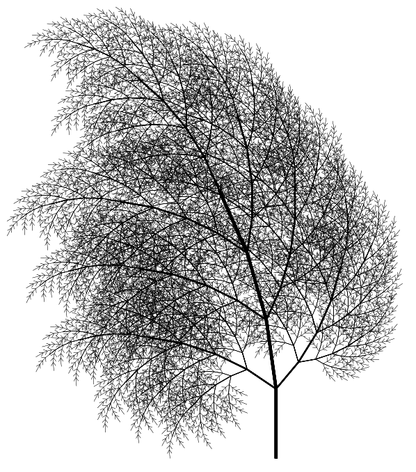
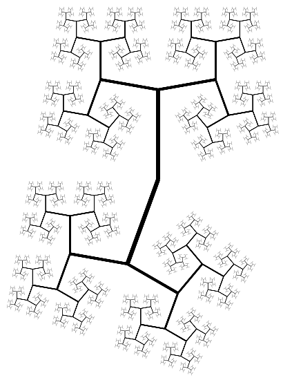

growth
======

Go package and executable that implements the Fractal Growth algorithm
described in The Computational Beauty of Nature by Gary William Flake (MIT
Press 2011). This algorithm generates self-similar fractals using a simple 
grammar-based approach called an L-System. 

The L-System grammar consists of a starting point (the seed) and a set of
expansion rules. The seed is used as the starting point and a sequence of
symbols is generated by evaluating the grammar repeatedly over a fixed number
of iterations. During each evaluation each symbol in the sequence is replaced
with a new set of symbols using the grammar's rules.

The final sequence of symbols is converted into an image by a plotter which
interprets the sequence as a list of movement commands for a simple turtle
graphics system.

## Installation

Simply run

    go get -u github.com/iand/growth

Documentation is at [http://godoc.org/github.com/iand/growth](http://godoc.org/github.com/iand/growth)

## Usage

For full control, import the `github.com/iand/growth/plot` package into your program, define a
`Grammar` and use a `Plotter` to draw it. This repository contains a sample application in
[`growth.go`](growth.go) that demonstrates how to control the generated image. If you ran the 
`go get` command above then the application will have been compiled into an executable present
at `$GOPATH/bin/growth`

Run the executable to generate the default plot of the big-h fractal, which will be written to a
file called growth.png. The particular fractal to draw can be specified with the `-e` command line
flag. See [`catalog/catalog.go`](catalog/catalog.go) for a list of pre-defined fractals. Use the
`-o` flag to change the output filename.

## Examples

### tree-2

### bent-big-h

LICENSE
=======
This is free and unencumbered software released into the public domain. For more
information, see <http://unlicense.org/> or the accompanying [`UNLICENSE`](UNLICENSE) file.
